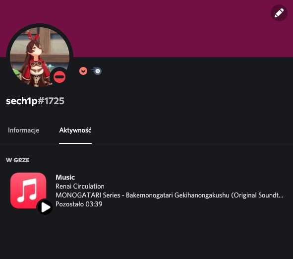

# Apple Music Discord RPC

A simple tool that displays in Discord status the music you are currently listening to on Apple Music

## ➕ Features

* You can show the world the music you taste without delay
* mInImAlIsTiC (if you give a f about this so)
* Fits in a few megabytes

> 

## 💾 Prerequisites

* macOS Catalina or newer (with `Music` app) / Windows 10 (with `iTunes` app)
* Discord (*i guess*)

## ▶️ Getting Started

Grab binary from [here](https://github.com/sech1p/AppleMusic_Discord_RPC/releases) and run it. That's all!

The binary for macOS is named as `darwin`

The binary for Windows is named as `windows`

## 💖 [Acknowledgments](ACKNOWLEDGMENTS.md)

## 📝 License

Apple Music Presence is licensed under the Apache License 2.0. Check the [LICENSE.md](LICENSE.md) file for more information.

## ⚠️ Disclaimer

We are not affiliated, associated, authorized, endorsed by, or in any way officially connected with Apple Inc. or any of its subsidiaries or its affiliates.

The official Apple Music® website can be found at https://music.apple.com.

The names Apple Music® as well as related names, marks, emblems and images are registered trademarks of their respective owners.
