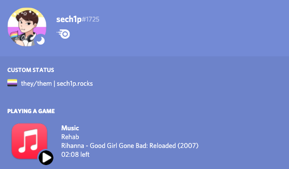

## Apple Music Discord RPC
### 👀 What's this?
This is a simple tool that displays in RPC Discord status the music you are currently listening to on Apple Music

### ➕ Pros
* Show the music you're listening to without much delay
* Lightweight (based on python3 and native macOS system tool)

Unfortunately, at the moment, Apple Music Rich Presence only works when listening to music in `Library`, we will try to fix it soon

### 🎥 RPC in action


### 💾 Prerequisites
* macOS operating system with the Music app (currently the script does not support Windows and Linux, however this may change in the future)
* Python 3
* Discord

### ▶️  Getting Started
```sh
$ git clone https://github.com/sech1p/AppleMusic-Discord-RPC.git
$ cd AppleMusic-Discord-RPC
$ python3 -m pip install -r requirements.txt
$ ./rpc
```

### 📝 License
Apple Music Discord RPC is licensed under the [AGPL-3.0](LICENSE) license
