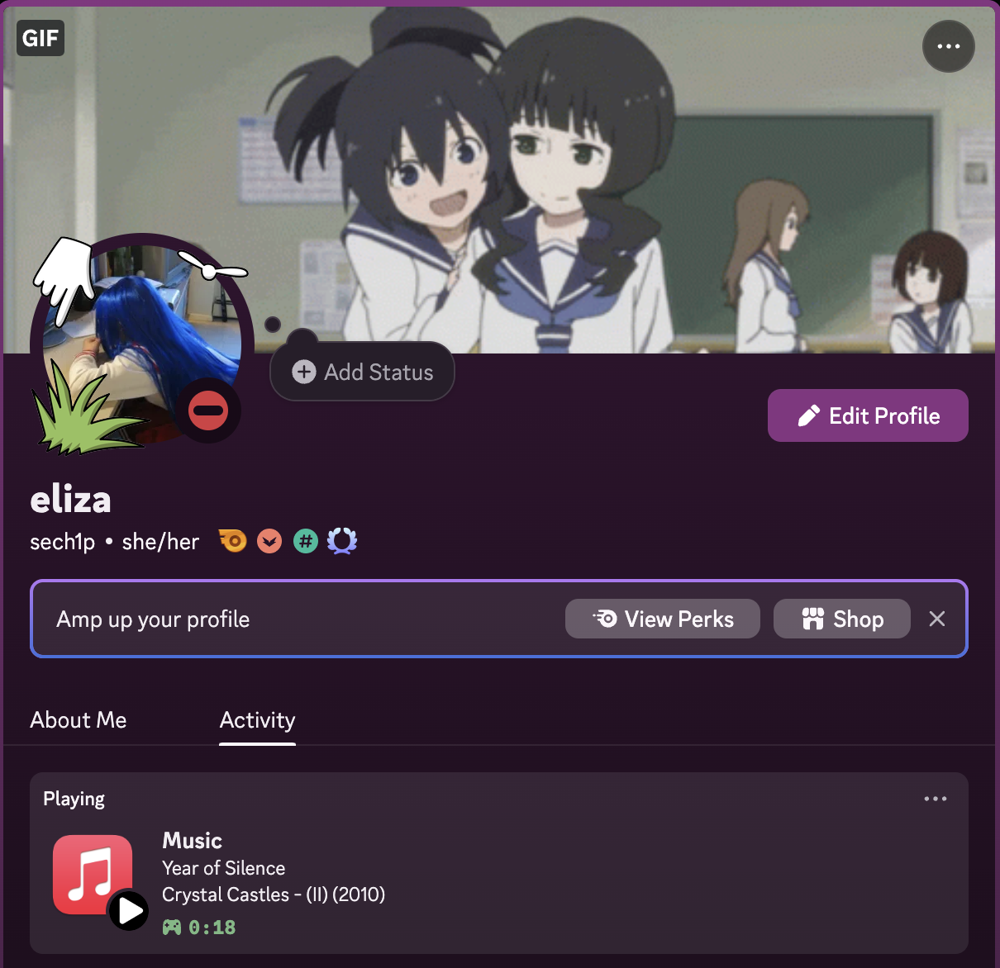

# 🎶 Apple Music Discord Presence

*A simple tool that displays in Discord status the music you are currently listening to on Apple Music.*

## ⚠️ Notice 

This Discord Rich Presence was created back to 2022. Then, I learning Go programming language and this project is result of this learning. Few years later, my programming practices are much different than then. That's why commits style are mixed.

Apple some time ago released Apple Music application for Windows, it not scripted by me yet. Apple Music for Windows support will be introduced in v1.3.0.

Version v1.2.1 (released in end of April 2025, almost 2 years after last Presence update) introduces Presence executable for Apple Silicon.

This Presence is rarely updated, expect new releases every few months.

## ➕ Features

* You can show the world the music you taste without delay.
* Minimalistic.
* Fits in a few megabytes.

> 

## 💾 Prerequisites

* macOS High Sierra* or newer (with `iTunes` or `Music` app in newest Macs) / Windows 10 (with `iTunes` app).
* Discord (obviously).

*Older versions has not been tested. As end of April 2025 Presence tested on macOS Sequoia 15.3.1. 

## ▶️ Getting Started

Grab binary from [here](https://github.com/sech1p/AppleMusic_Discord_RPC/releases) and run it. That's all!

Or on Macs with [Homebrew](https://brew.sh) package manager, you can install this Presence by:

```sh
$ brew tap sech1p/homebrew
$ brew install applemusic_discord_rpc
```

Additionally - on newests macOS, click `Allow` if you got pop-up about permissions to controlling Apple Music by this script.

## 💖 [Acknowledgments](ACKNOWLEDGMENTS.md)

## 📝 License

Apple Music Presence is licensed under the Apache License 2.0. Check the [LICENSE.md](LICENSE.md) file for more information.

## ⚠️ Disclaimer

We are not affiliated, associated, authorized, endorsed by, or in any way officially connected with Apple Inc. or any of its subsidiaries or its affiliates.

The official Apple Music® website can be found at https://music.apple.com.

The names Apple Music® as well as related names, marks, emblems and images are registered trademarks of their respective owners.
